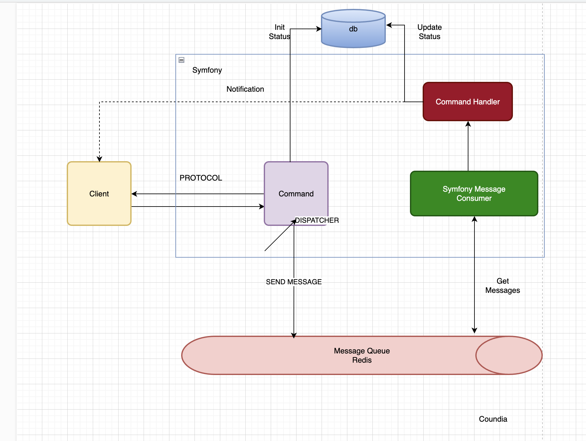
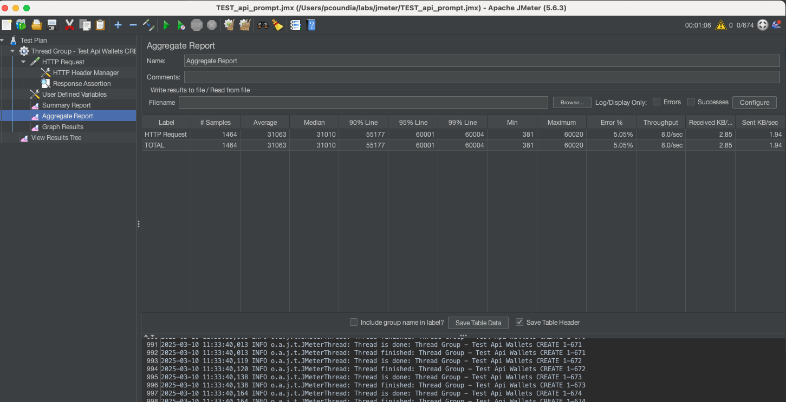
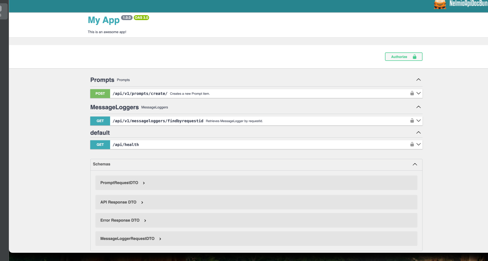

# ddd-maker-bundle Usage

This project is a middleware that retrieves a prompt, adds it to the Redis queue, and asynchronously connects to a configured AI.

This project is generated by the [ddd-maker-bundle](https://packagist.org/packages/cnd/ddd-maker-bundle).

## Installation

### 1. Clone the repository

    git clone https://github.com/coundia/ddd-maker-bundle-usage-demo.git

### 2. Run with Docker

#### a. Install dependencies

    composer install

#### b. Start the application with Docker

    docker compose up -d --build

---

### USAGE

---
```
docker compose up -d --build
```
Api docs
[http://127.0.0.1:8000/api/docs](http://127.0.0.1:8000/api/docs)
---
## Send prompt, it will return your requestId(used in api status)
--- 
```
curl -X 'POST' \
'http://127.0.0.1:8000/api/v1/prompts/create/' \
-H 'accept: application/json' \
-H 'Content-Type: application/json' \
-d '{
"prompt": "This is a test prompt"
}'
  
```
---
## Check status
```
curl -X 'GET' \
  'http://127.0.0.1:8000/api/v1/messageloggers/findbyrequestid?requestId=your_requestId' \
  -H 'accept: application/json'
```
## Consume Queue (task queue)

```
docker-compose exec php bin/console mess:cons -vv
```

## Monitor REDIS (task monitor)
```
docker-compose exec redis redis-cli MONITOR
```
## Re-check status
```
curl -X 'GET' \
  'http://127.0.0.1:8000/api/v1/messageloggers/findbyrequestid?requestId=your_requestId' \
  -H 'accept: application/json'
```

## Architecture Overview

The architecture of this middleware application can be broken down into the following key components:

1. **Client Interface (Prompt Handler)**:
	- Receives a prompt from the user, which will be processed by the middleware.

2. **Redis Queue**:
	- The prompt is placed into a Redis queue to manage the order of tasks and asynchronous processing.

3. **AI Processing (Async Connector)**:
	- An AI service is configured to consume the prompt from the queue and process it asynchronously.

4. **Middleware**:
	- Acts as the coordinator between the client interface, Redis, and AI, ensuring smooth operation and task delegation.

---

## Architecture Diagram

    +-------------------+        +-----------------+        +-----------------------+
    |  Client Interface |  --->  |   Redis Queue   |  --->  |    AI Processing      |
    |  (Prompt Handler) |        |   (Task Queue)  |        |   (Async Connector)   |
    +-------------------+        +-----------------+        +-----------------------+

1. **Client Interface** sends prompts to the system.
2. **Redis Queue** queues the prompt for processing.
3. **AI Processing** handles the prompt asynchronously.
4. The **Middleware** ensures the connection and proper task flow.



## REMARK
IF edit the code restart the QUEUE


## TEST Performance with Jmeter (env local with sqlite db)
[https://jmeter.apache.org/usermanual/get-started.html](https://jmeter.apache.org/usermanual/get-started.html)



Samples	1464	Total number of requests sent.
Average	31063 ms	The average response time (in milliseconds).
Median	31010 ms	The middle value of response times.
90% Line	55177 ms	90% of requests completed within this time.
95% Line	60001 ms	95% of requests completed within this time.
99% Line	60004 ms	99% of requests completed within this time.
Min	381 ms	The shortest response time recorded.
Max	60020 ms	The longest response time recorded.
Error %	5.05%	Percentage of requests that failed.
Throughput	8.0/sec	The number of requests handled per second.
Received KB/sec	2.85 KB/sec	Data received per second.
Sent KB/sec	1.94 KB/sec	Data sent per second.

## Observations

The error rate (5.05%) means some requests are failing (it's ok)


